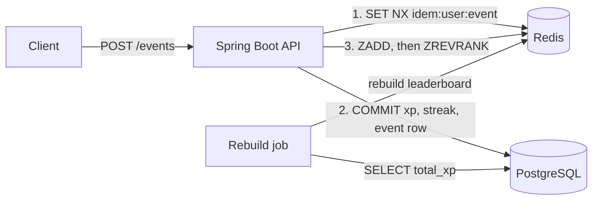

# XP Engine

Gamification backend: XP awards, daily streaks, and a live leaderboard.
Java 21, Spring Boot 3, PostgreSQL 16, Redis 7.

## Architecture



## Design decisions

- **Server decides XP.** The client sends an event type, never an amount.
- **Atomic idempotency.** One `SET NX` per `(user, eventId)`. `UNIQUE(user_id, event_id)` in Postgres is the backstop if Redis is down.
- **Retries look like success.** Duplicate returns 200 with `duplicate: true` and awards nothing.
- **Postgres first, Redis second.** A failed DB write never leaves the leaderboard ahead of the truth. A scheduled rebuild repairs any drift.
- **Redis down is not an outage.** XP is still awarded; `rank` comes back `null`.
- **Streaks use the user's timezone**, via a pure, unit-tested function.

## Run

```bash
docker compose up -d
mvn test
mvn spring-boot:run
curl -X POST localhost:8080/events -H 'Content-Type: application/json' \
  -d '{"userId":1,"eventId":"evt-1","type":"LESSON_COMPLETED"}'
```
(Insert a user first: `INSERT INTO users (id) VALUES (1);`)
